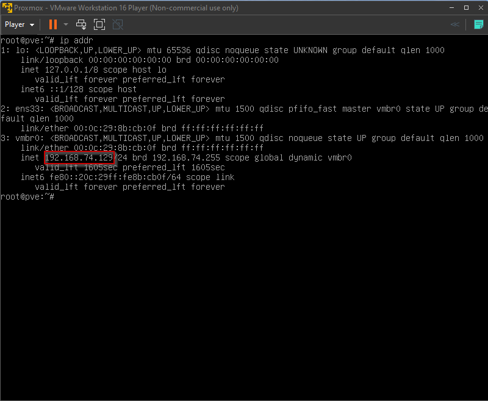

# Local Setup

When developing locally with CSLabs, you have two options.

Option 1: Connect to the Application's network and utilize the built in proxmox servers.
Option 2: Virtualize your own Proxmox setup.

This guide focuses on option 2.

### Setup Proxmox VM

1. [Download vmware Workstation player](https://www.vmware.com/products/workstation-player/workstation-player-evaluation.html)
2. Make sure VT-X (Intel Virtualization Technology) is enabled in your BIOS (it might already be) 
   You will need to google how to access your bios and do this.
   vmware Workstation player won't be able to start the VM if this isn't configured correctly.
3. Download VM
4. Start VM
5. Login username: root, password: password
6. run `ip addr` and copy the ip address listed after `inet`. In my case it is `192.168.74.129`

7. Open Firefox and go to https://<the-ip-address-you-copied>:8006/
8. The VM takes a little while to start the webserver so you might need to try step 7 a couple times until it comes up.
9. Login, same credentials: username: root, password: password
